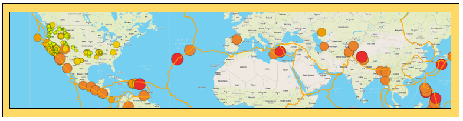
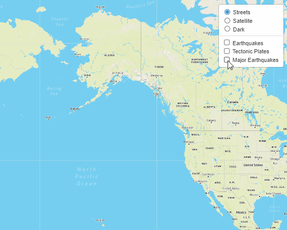

# Mapping_Earthquakes
*An interactive earthquake maps with JavaScript and Leaflet*

***Note:*** Final documents are stored in [Earthquake_Challenge](Earthquake_Challenge) directory. Please find the explanation of the files below. Code needs an API Key from Matbox in order to run. The API key is not included for safety reasons. Other files are included because of the detailed procedure of working with Mapbox, Leaflet and GitHub branching.  

## Overview of Project
## Purpose

For this project I am creating an **interactive map** that shows the latest **earthquake activity around the world**. Maps allow us to explore, understand and make decisions about our world. Providing data-driven storytelling on disasters around the world and building insightful data visualization with interactive features is a valuable addition to the knowledge and awareness of the planet Earth events. 

A world map of earthquakes

The map of earthquakes around the world contains:
-	Switch on/off button for **fault lines** of tectonic plates.
-	Switch on/off button for the **earthquakes of the past 7 days**.
-	Switch on/off button for the **major earthquakes of the magnitude above 4.5**.
-	Three different **map styles**:
    - Street view.
    - Satellite view. 
    - Dark view.
-	**A popup marker** with information about the location and the magnitude of the location
-	**The diameter** and **the color** of a marker reflect the strength of the earthquake (darker color with larger diameter represent earthquakes with a higher magnitude).
-	**A legend** with the context for the map.

An interactive world map of earthquakes

## Background

Creating interactive maps is supported by specifically developed tools. For this project I used the following:

-	**Mapbox API**, an open source mapping platform that allows to create a custom design of the map and is used across the industries. 

-	**Leaflet**, a JavaScript library, designed to build the web mapping applications. 

-	**GeoJson** files that are specifically design to host geographical information. GeoJson files are the industry standard for representing simple geographical features, such as points, linestrings and polygons and non-spatial attributes, such as magnitude of the earthquake, hurricane strength, hail size, elevation, etc.

## Resources
**Data Source:**
- GeoJson file for Tectonic Plates retrieved from GitHub repository: https://github.com/fraxen/tectonicplates/tree/master/GeoJSON
- GeoJson file for Earthquakes for the past 7 days retrieved via API call from USGS website: https://earthquake.usgs.gov/earthquakes/feed/v1.0/summary/all_week.geojson
- GeoJson file for Major Earthquakes (M4.5+) for the past 7 days via API call from USGS website: https://earthquake.usgs.gov/earthquakes/feed/v1.0/summary/4.5_week.geojson

**Software:**
-	Mapbox API [challenge_logic.js](static/js/challenge_logic.js)
-	VS Code and Chrome Developer Tools

**Languages:**
-	JavaScript, 
-	[HTML](index.html) and [CSS](static/css/style.css) 

**Libraries:**
- D3, Leaflet

